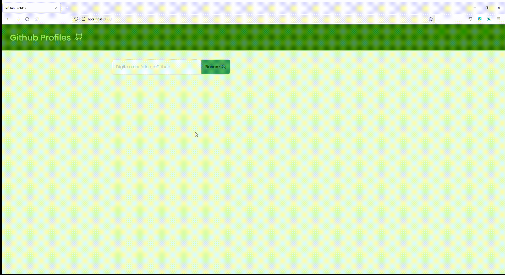

# GitHub Profiles

Aplicação desenvolvida para pesquisa de informações do usuário GitHub  utilizando sua API. Na pesquisa, quando um nome de usuário válido é inserido ele irá exibir avatar, nome de usuário, contagem de seguidores, contagem de repositório, 4 repositórios principais.

- Ir para aplicação [aqui](https://github-profiles-lailsonlm.vercel.app/) 
- Ideia retirada do [App-ideas](https://github.com/florinpop17/app-ideas)
## User Stories

-   [x] User can enter a username
-   [x] User can click on search button to retrieve information
-   [x] User can see the avatar, username, followers and repository count of searched user
-   [x] User can see the top 4 repositories of searched user
-   [x] User should get an alert if the username is not valid

## Bonus features
-  [ ] User can toggle dark/light mode
-  [ ] Selected mode should persist when user comes back to the app again
